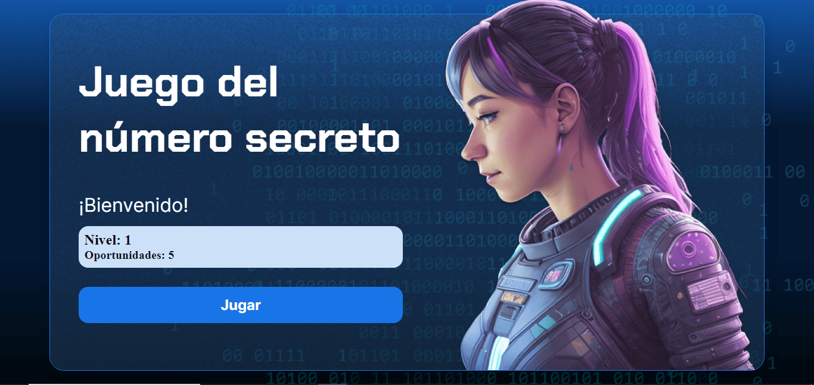

# Juego del número secreto
### Desarrollado durante el programam Oracle Next Education(ONE) junto con Alura Latam

  

  
  
  

## Descripción
El juego del número secreto es un juego de lógica en el que debes adivinar un número oculto. Donde pondrás a prueba tu intuición mientras intentas descubrir el número correcto en el menor número de intentos posible. ¡Desafía a tus amigos y demuestra quién es el mejor en descifrar el número secreto! ¿Tienes lo necesario para convertirte en el maestro de la adivinanza? ¡Juega ahora y descúbrelo!

[Jugar🎮](https://obregon-jose.github.io/numero-secreto/)
